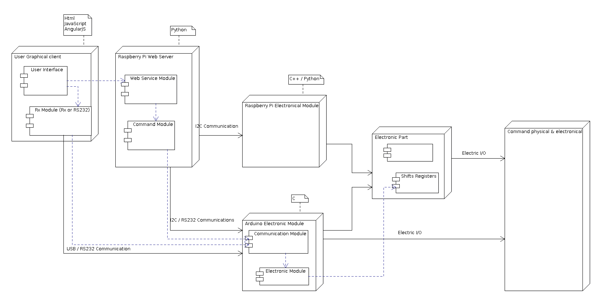

# Architecture presentation

This part present the global architecture for this project

The complet architecture is define on this schem:

We have many device configuration to use this software

1. Standalone configuration
Use  in a simple context of development, it use a computer and an Arduino device
The computer host the HTML command interface, the web service and the RS232 Arduino communication

2. Web Server, RaspberryPi and HTML client

3. Web Server, RaspberryPi, arduino and HTML client

