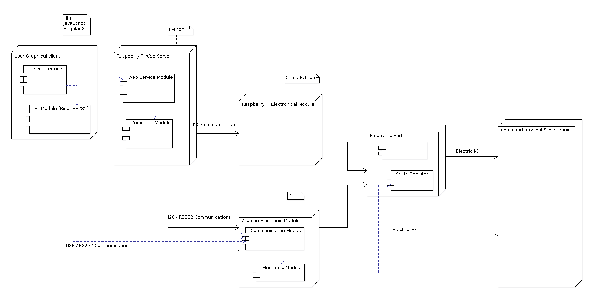
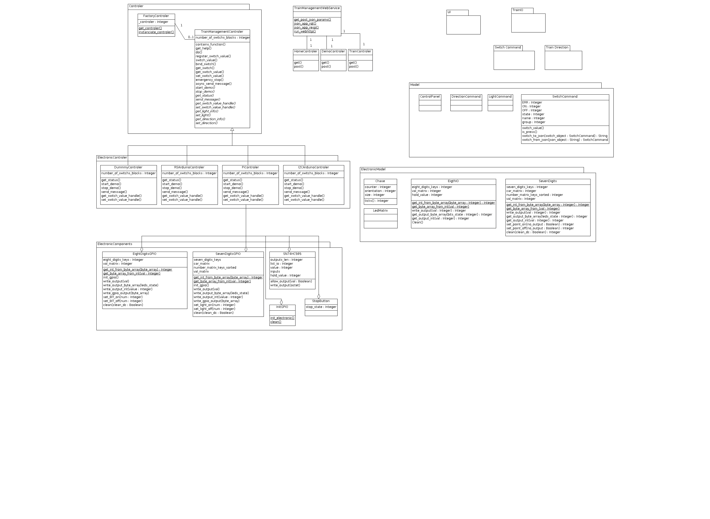

# TrainManagement

This program is about Train Remote Control.
If you have a Numeric or Analogic train at home, and you already have electric switch, lights and other composants,
you will use this program to control the train by PC.
Start, stop, change way, ...

In a future, a video recorder will give you back inforamtions on your PC.

## Compatibility

Solaris, BSD, Linux or Windows plateforme compatible.
Docker compatible too.

## Using with Raspberry

Using a Raspberry Pi2 B+ or Pi3 to manage IO directly,
you can append an Arduino if you want to split in many layers the control part.

The UI will interact by web services (protocol http or pipe -prefered-) in a first time under WebBrowser.
A second UI will create in GTK+ for multi-plateform. A third maybe for mobiles (but not sure cause doublons with Web Browser).

In Raspberry, install the requests and smbus python libraries like:
(as su -u root)
apt-get install pip3
pip3 install web
pip3 install requests
pip3 install smbus

## Using on Linux

If you want to skip the RaspBerry part and use directly your Linux with the I2C and Arduino, install:
(as su -u root)
apt-get install pip3
pip3 install web
pip3 install requests
pip3 install smbus2 (new link to replace the smbus-cffi package)
pip3 install pysmbus

## Start the complet tool

### Build the project

 - On Linux
execute the script `./compile.sh` (make sur the executing mode is enabled chmod +x ./compile.sh)
 
 - On Windows
execute the script `./compile.ps1`

 - On both platform (prereauisis PowerShell)
execute the script `./compile.ps1` (make sur the executing mode is enabled chmod +x ./compile.ps1)

### Run the project

 - Start the Web Service API
`python .\TrainManagementWebServer.py [ ElectronicController.DummyController ]`

 - Use the User Interface
open the `./Build/UI/TrainManagement.html` in your favorite browser

### Debug the project

 - in web browser
 
 `http://localhost:8088/TrainManagement.py?control=get_help&functionName=Switch&functionValue=Off`

 - Call this WebService in Powershell like
 
`# curl -Headers @{ "Accept" = "application/json" } "http://[computer name]:8088/train_control/test=34&tty=toto"`

`# curl -Headers @{ "Accept" = "application/json" } "http://[computer name]:8088/demo/register_switch_value" -Body @{"name" = "tty"; "value" = 1} -ContentType "application/json; charset=utf-8"`

## Hardware architecture

This project is splitted in multi hardware part

## Software structure

